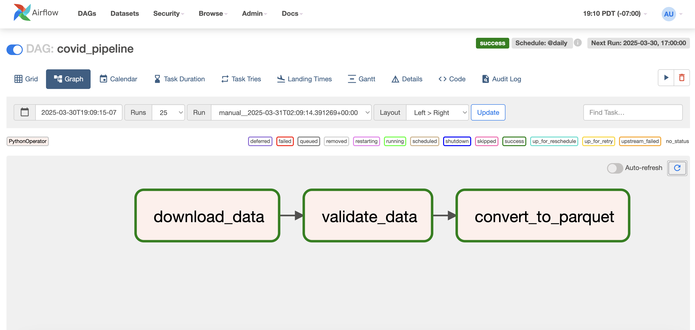

# COVID-19 Data Pipeline with Airflow

A simple data pipeline to download, validate, and convert COVID-19 data using Apache Airflow.



## 🚀 Project Overview
This project demonstrates core data engineering concepts:
1. **Orchestration**: Scheduling tasks with Airflow DAGs.
2. **Data Quality**: Validating data with Great Expectations.
3. **Storage Optimization**: Converting CSV to Parquet for efficiency.

## ⚙️ Features
- **Automated Pipeline**: Daily download of COVID-19 data.
- **Data Validation**: Checks for missing values in critical columns.
- **Local Storage**: Saves data as CSV and Parquet.

## 🛠️ Tech Stack
- **Orchestration**: Apache Airflow
- **Data Validation**: Great Expectations
- **Storage**: Parquet
- **Infrastructure**: Docker

## 🏃 Setup Instructions
1. **Clone the repo**:
   ```bash
   git clone https://github.com/venvelamakanni/covid-data-pipeline.git
   cd covid-data-pipeline